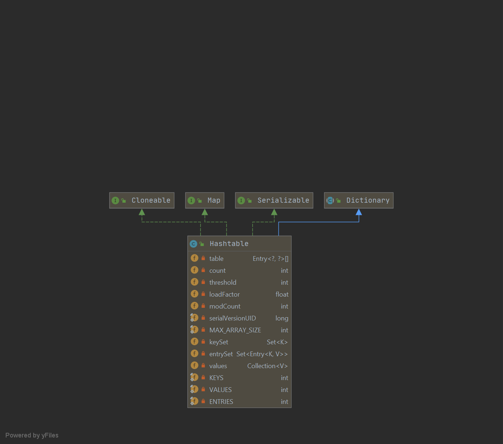
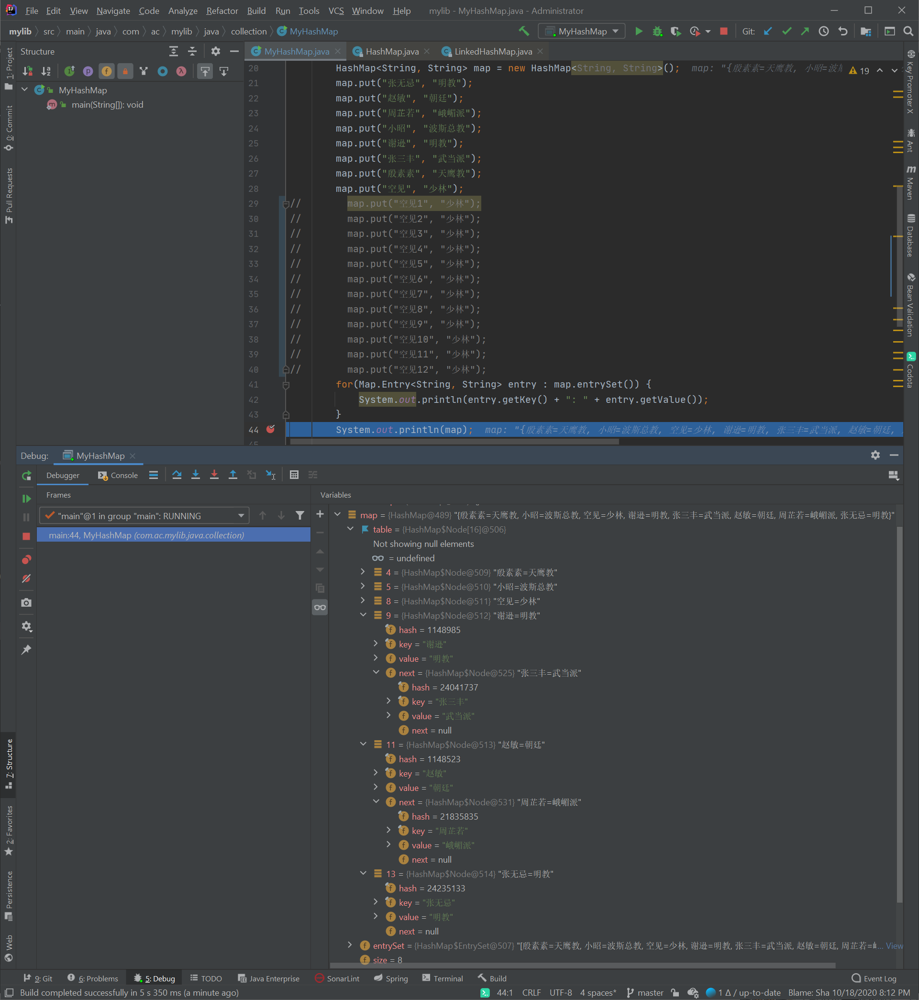
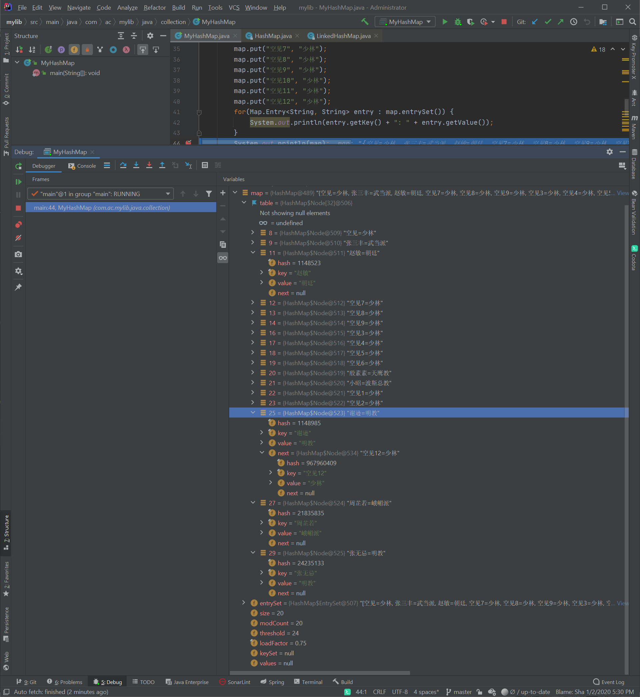

------

# 源码浅析_Java_Collection_HashMap

> 作者：Echo

HashMap是基于哈希表的 Map 接口的实现。此实现提供所有可选的映射操作，并允许使用 null 值和 null 键。（除了非同步和允许使用 null 之外，HashMap 类与 Hashtable 大致相同。）此类不保证映射的顺序，特别是它不保证该顺序恒久不变。 

此实现假定哈希函数将元素适当地分布在各桶之间，可为基本操作（get 和 put）提供稳定的性能。迭代 collection 视图所需的时间与 HashMap 实例的“容量”（桶的数量）及其大小（键-值映射关系数）成比例。所以，如果迭代性能很重要，则不要将初始容量设置得太高（或将加载因子设置得太低）。 

HashMap 的实例有两个参数影响其性能：初始容量 和加载因子。容量 是哈希表中桶的数量，初始容量只是哈希表在创建时的容量。加载因子 是哈希表在其容量自动增加之前可以达到多满的一种尺度。当哈希表中的条目数超出了加载因子与当前容量的乘积时，则要对该哈希表进行 rehash 操作（即重建内部数据结构），从而哈希表将具有大约两倍的桶数。 

通常，默认加载因子 (.75) 在时间和空间成本上寻求一种折衷。加载因子过高虽然减少了空间开销，但同时也增加了查询成本（在大多数 HashMap 类的操作中，包括 get 和 put 操作，都反映了这一点）。在设置初始容量时应该考虑到映射中所需的条目数及其加载因子，以便最大限度地减少 rehash 操作次数。如果初始容量大于最大条目数除以加载因子，则不会发生 rehash 操作。 

如果很多映射关系要存储在 HashMap 实例中，则相对于按需执行自动的 rehash 操作以增大表的容量来说，使用足够大的初始容量创建它将使得映射关系能更有效地存储。 

注意，此实现不是同步的。如果多个线程同时访问一个哈希映射，而其中至少一个线程从结构上修改了该映射，则它必须 保持外部同步。（结构上的修改是指添加或删除一个或多个映射关系的任何操作；仅改变与实例已经包含的键关联的值不是结构上的修改。）这一般通过对自然封装该映射的对象进行同步操作来完成。如果不存在这样的对象，则应该使用 Collections.synchronizedMap 方法来“包装”该映射。最好在创建时完成这一操作，以防止对映射进行意外的非同步访问，如下所示：

   Map m = Collections.synchronizedMap(new HashMap(...));

由所有此类的“collection 视图方法”所返回的迭代器都是fail-fast（快速失败） 的：在迭代器创建之后，如果从结构上对映射进行修改，除非通过迭代器本身的 remove 方法，其他任何时间任何方式的修改，迭代器都将抛出 ConcurrentModificationException。因此，面对并发的修改，迭代器很快就会完全失败，而不冒在将来不确定的时间发生任意不确定行为的风险。 

注意，迭代器的fail-fast（快速失败）行为不能得到保证，一般来说，存在非同步的并发修改时，不可能作出任何坚决的保证。快速失败迭代器尽最大努力抛出 ConcurrentModificationException。因此，编写依赖于此异常的程序的做法是错误的，正确做法是：迭代器的fail-fast（快速失败）行为应该仅用于检测程序错误

> 以上中文翻译摘自：https://tool.oschina.net/apidocs/apidoc?api=jdk-zh

## Diagram图



## 数据结构

HashMap底层采用的是数组和链表组合在一起的链表数组，Hash Map通过扰动函数得到key的hash值

这个hash值并不是一般意义上hashCode值（key.hashCode()），先用key.hashCode()获取到key的hashCode值，再将这个hashCode值做一次扰动处理得到的值就作为这个HashMap的hash值

```java
// 扰动函数就是HashMap的hash()方法
static final int hash(Object key) {
    int h;
    return (key == null) ? 0 : (h = key.hashCode()) ^ (h >>> 16);
}
```

然后用这个hash值对HashMap的桶（bucket）数量n取余，得到这个value对应桶中的位置，如果当前的位置没有元素的话就直接插入；如果存在元素，就判断存入元素value的值（hash值）和key是否相同，一样就覆盖，不一样要通过拉链法来解决冲突。

**注意：**正常的取余操作是hash  %  n，但是这里采用的是（n -1）& hash，而且n必须是2的m次幂！

## 源码解析

### 成员变量

```java
public class HashMap<K,V> extends AbstractMap<K,V>
    implements Map<K,V>, Cloneable, Serializable {

    /**
     * 默认初始容量 - 必须是2的整数次幂.
     */
    static final int DEFAULT_INITIAL_CAPACITY = 1 << 4; // aka 16

    /**
     * 使用有参构造函数时，最大的容量，必须小于2的30次幂.
     */
    static final int MAXIMUM_CAPACITY = 1 << 30;

    /**
     * 构造函数中的默认负载因子.
     */
    static final float DEFAULT_LOAD_FACTOR = 0.75f;

    /**
     * 桶中节点转化成红黑树的阈值，要大于2，大于8时转红黑树.
     */
    static final int TREEIFY_THRESHOLD = 8;

    /**
     * 红黑树的节点数阈值，小于6时红黑树转链表.
     */
    static final int UNTREEIFY_THRESHOLD = 6;

    /**
     * 链转树的最小table容量，桶里有太多节点的话会扩容，至少是4 x TREEIFY_THRESHOLD才能避免冲突.
     * 注意：并不是链表长度大于8就转树，大于8小于64时先扩容，大于64才会转红黑树！！！
     */
    static final int MIN_TREEIFY_CAPACITY = 64;
    
    /**
     * The table, initialized on first use, and resized as
     * necessary. When allocated, length is always a power of two.
     * (We also tolerate length zero in some operations to allow
     * bootstrapping mechanics that are currently not needed.)
     * 初始化时的table，必要时会扩容，分配内存时长度总是2的幂次方，这个是存放元素的数组。
     */
    transient Node<K,V>[] table;

    /**
     * Holds cached entrySet(). Note that AbstractMap fields are used
     * for keySet() and values().
     * 持有的缓存键值对，注意有两个来自AbstractMap的字段keySet() 和 values()
     */
    transient Set<Map.Entry<K,V>> entrySet;

    /**
     * The number of key-value mappings contained in this map.
     * 键值对的个数，不等于数组的长度！
     */
    transient int size;

    /**
     * The number of times this HashMap has been structurally modified
     * Structural modifications are those that change the number of mappings in
     * the HashMap or otherwise modify its internal structure (e.g.,
     * rehash).  This field is used to make iterators on Collection-views of
     * the HashMap fail-fast.  (See ConcurrentModificationException).
     * HashMap被结构性修改的次数，这个字段是用来做HashMap的集合视图的迭代器的fail-fast的。
     */
    transient int modCount;

    /**
     * The next size value at which to resize (capacity * load factor).
     * 扩容阈值，当实际大小超过capacity * load factor时扩容
    int threshold;

    /**
     * The load factor for the hash table.
     * 负载因子
     */
    final float loadFactor;
```

### 内部静态类

### 构造方法

```java
/**
 * Constructs an empty <tt>HashMap</tt> with the default initial capacity
 * (16) and the default load factor (0.75).
 * 使用默认容量16和0.75作为负载因子构造一个空的HashMap。
 */
public HashMap() {
    this.loadFactor = DEFAULT_LOAD_FACTOR; // all other fields defaulted
}
/**
 * Constructs an empty <tt>HashMap</tt> with the specified initial
 * capacity and load factor.
 * 通过指定的容量和负载因子构造一个空的HashMap。
 */
public HashMap(int initialCapacity, float loadFactor) {
    if (initialCapacity < 0)
        throw new IllegalArgumentException("Illegal initial capacity: " +
                                           initialCapacity);
    if (initialCapacity > MAXIMUM_CAPACITY)
        initialCapacity = MAXIMUM_CAPACITY;
    if (loadFactor <= 0 || Float.isNaN(loadFactor))
        throw new IllegalArgumentException("Illegal load factor: " +
                                           loadFactor);
    this.loadFactor = loadFactor;
    this.threshold = tableSizeFor(initialCapacity);
}

/**
 * Constructs an empty <tt>HashMap</tt> with the specified initial
 * capacity and the default load factor (0.75).
 * 通过一个指定的容量，使用默认的负载因子0.75构造一个空的HashMap.
 */
public HashMap(int initialCapacity) {
    this(initialCapacity, DEFAULT_LOAD_FACTOR);
}

/**
 * Constructs a new <tt>HashMap</tt> with the same mappings as the
 * specified <tt>Map</tt>.  The <tt>HashMap</tt> is created with
 * default load factor (0.75) and an initial capacity sufficient to
 * hold the mappings in the specified <tt>Map</tt>.
 * 通过一个指定的Map构造一个新的HashMap。
 */
public HashMap(Map<? extends K, ? extends V> m) {
    this.loadFactor = DEFAULT_LOAD_FACTOR;
    putMapEntries(m, false);
}
```

### put

我们只能使用put方法，putVal没有暴露出来给我们使用。

```java
/**
 * Associates the specified value with the specified key in this map.
 * If the map previously contained a mapping for the key, the old
 * value is replaced.
 *
 * @param key key with which the specified value is to be associated
 * @param value value to be associated with the specified key
 * @return the previous value associated with <tt>key</tt>, or
 *         <tt>null</tt> if there was no mapping for <tt>key</tt>.
 *         (A <tt>null</tt> return can also indicate that the map
 *         previously associated <tt>null</tt> with <tt>key</tt>.)
 */
public V put(K key, V value) {
    return putVal(hash(key), key, value, false, true);
}

/**
 * Implements Map.put and related methods.
 *
 * @param hash hash for key
 * @param key the key
 * @param value the value to put
 * @param onlyIfAbsent if true, don't change existing value
 * @param evict if false, the table is in creation mode.
 * @return previous value, or null if none
 */
final V putVal(int hash, K key, V value, boolean onlyIfAbsent,
               boolean evict) {
    Node<K,V>[] tab; Node<K,V> p; int n, i;
    // table为空或者长度为0，进行扩容
    if ((tab = table) == null || (n = tab.length) == 0)
        n = (tab = resize()).length;
    // hash & n取余确定元素在桶中的位置index
    if ((p = tab[i = (n - 1) & hash]) == null)
        // 桶是空的，生成一个节点放在桶里，此时该节点是放在数组里的
        tab[i] = newNode(hash, key, value, null);
    else {
        // 桶不是空的
        Node<K,V> e; K k;
        // p是既存的节点，当
        // 1. p的key和需要存入的key或者，需要存入的key不为空且这个key等于既存的key时
        // 2. 需要存入的key的hash值和既存的hash值相等时
        if (p.hash == hash &&
            ((k = p.key) == key || (key != null && key.equals(k))))
            // 1，2同时满足时，将e指向p，用e来表示
            e = p;
        // p是红黑树时候的判断，p是红黑树表示节点数已经大于8了。
        else if (p instanceof TreeNode)
            e = ((TreeNode<K,V>)p).putTreeVal(this, tab, hash, key, value);
        // 链表结构
        else {
            for (int binCount = 0; ; ++binCount) {
                // 既存的节点后面没有节点，可以直接插入新的节点
                if ((e = p.next) == null) {
                    p.next = newNode(hash, key, value, null);
                    // 链表数量大于阈值8，需要树型话，注意并不是转成红黑树，小于64的话是resize扩容，大于64才会转成红黑树！
                    if (binCount >= TREEIFY_THRESHOLD - 1) // -1 for 1st
                        treeifyBin(tab, hash);
                    break;
                }
                // 此时e就是p，需要存入的hash和既存的hash值相等，key也相等的话就结束
                if (e.hash == hash &&
                    ((k = e.key) == key || (key != null && key.equals(k))))
                    break;
                // 用于遍历桶中的链表，与前面的e = p.next组合，可以遍历链表，这步很厉害
                p = e;
            }
        }
        // key值和key的hash值相等的时候
        if (e != null) { // existing mapping for key
            // 既存的value值
            V oldValue = e.value;
            // onlyIfAbsent为false和oldValue为空时
            if (!onlyIfAbsent || oldValue == null)
                // 覆盖旧值
                e.value = value;
            // 存在LinkedHashMap中的访问后回调函数
            afterNodeAccess(e);
            return oldValue;
        }
    }
    // 结构性修改变量记录值加1
    ++modCount;
    // 实际大小超过阈值，要扩容
    if (++size > threshold)
        resize();
    // 存在LinkedHashMap中的插入后回调函数
    afterNodeInsertion(evict);
    return null;
}
```

### treeifyBin

这个树型化方法是用来做链转树操作的，注意的是，并不是一定会把链表转成红黑树，在table比较小的时候，即当**tab.length < MIN_TREEIFY_CAPACITY（64）**时仅仅进行**resize()**操作，不会进行链转树操作，只有当tab的长度大于等于64时才会进行链转树操作！

```java
/**
 * Replaces all linked nodes in bin at index for given hash unless
 * table is too small, in which case resizes instead.
 */
final void treeifyBin(Node<K,V>[] tab, int hash) {
    int n, index; Node<K,V> e;
    if (tab == null || (n = tab.length) < MIN_TREEIFY_CAPACITY)
        resize();
    else if ((e = tab[index = (n - 1) & hash]) != null) {
        TreeNode<K,V> hd = null, tl = null;
        do {
            TreeNode<K,V> p = replacementTreeNode(e, null);
            if (tl == null)
                hd = p;
            else {
                p.prev = tl;
                tl.next = p;
            }
            tl = p;
        } while ((e = e.next) != null);
        if ((tab[index] = hd) != null)
            hd.treeify(tab);
    }
}
```

### resize

HashMap的扩容方法，此方法会进行一次再hash分配，会重新遍历HashMap中所有元素，并且重新计算元素在新table中的位置index，是非常耗时的一件事。

当put时，如果发现目前的bucket占用程度已经超过了Load Factor所希望的比例，那么就会发生resize。在resize的过程，简单的说就是把bucket扩充为2倍，之后重新计算index，把节点再放到新的bucket中。resize的注释是这样描述的：

> Initializes or doubles table size. If null, allocates in accord with initial capacity target held in field threshold. Otherwise, because we are using power-of-two expansion, the elements from each bin must either stay at same index, or move with a power of two offset in the new table.

大致意思就是说，当超过限制的时候会resize，然而又因为我们使用的是2次幂的扩展(指长度扩为原来2倍)，所以，元素的位置要么是在原位置，要么是在原位置再移动2次幂的位置。

怎么理解呢？例如我们从16扩展为32时，具体的变化如下所示：


因此元素在重新计算hash之后，因为n变为2倍，那么n-1的mask范围在高位多1bit(红色)，因此新的index就会发生这样的变化：


因此，我们在扩充HashMap的时候，不需要重新计算hash，只需要看看原来的hash值新增的那个bit是1还是0就好了，是0的话索引没变，是1的话索引变成“原索引+oldCap”。可以看看下图为16扩充为32的resize示意图：


这个设计确实非常的巧妙，既省去了重新计算hash值的时间，而且同时，由于新增的1bit是0还是1可以认为是随机的，因此resize的过程，均匀的把之前的冲突的节点分散到新的bucket了。

> 链接：https://www.fangzhipeng.com/javainterview/2019/03/15/collections-hashmap.html
> 出自[方志朋的博客](https://www.fangzhipeng.com/)

```java
/**
 * Initializes or doubles table size.  If null, allocates in
 * accord with initial capacity target held in field threshold.
 * Otherwise, because we are using power-of-two expansion, the
 * elements from each bin must either stay at same index, or move
 * with a power of two offset in the new table.
 *
 * @return the table
 */
final Node<K,V>[] resize() {
    Node<K,V>[] oldTab = table;
    int oldCap = (oldTab == null) ? 0 : oldTab.length;
    int oldThr = threshold;
    int newCap, newThr = 0;
    if (oldCap > 0) {
        // 超过了HashMap的容量上限就不扩容了，只能去碰撞了
        if (oldCap >= MAXIMUM_CAPACITY) {
            threshold = Integer.MAX_VALUE;
            return oldTab;
        }
        // 容量扩容成原来的2倍
        else if ((newCap = oldCap << 1) < MAXIMUM_CAPACITY &&
                 oldCap >= DEFAULT_INITIAL_CAPACITY)
            newThr = oldThr << 1; // double threshold
    }
    else if (oldThr > 0) // initial capacity was placed in threshold
        newCap = oldThr;
    else {               // zero initial threshold signifies using defaults
        // 初始化一个HashMap的容量和阈值
        newCap = DEFAULT_INITIAL_CAPACITY;
        newThr = (int)(DEFAULT_LOAD_FACTOR * DEFAULT_INITIAL_CAPACITY);
    }
    if (newThr == 0) {
        float ft = (float)newCap * loadFactor;
        newThr = (newCap < MAXIMUM_CAPACITY && ft < (float)MAXIMUM_CAPACITY ?
                  (int)ft : Integer.MAX_VALUE);
    }
    threshold = newThr;
    @SuppressWarnings({"rawtypes","unchecked"})
    Node<K,V>[] newTab = (Node<K,V>[])new Node[newCap];
    table = newTab;
    if (oldTab != null) {
        for (int j = 0; j < oldCap; ++j) {
            Node<K,V> e;
            if ((e = oldTab[j]) != null) {
                oldTab[j] = null;
                if (e.next == null)
                    newTab[e.hash & (newCap - 1)] = e;
                else if (e instanceof TreeNode)
                    ((TreeNode<K,V>)e).split(this, newTab, j, oldCap);
                else { // preserve order
                    Node<K,V> loHead = null, loTail = null;
                    Node<K,V> hiHead = null, hiTail = null;
                    Node<K,V> next;
                    do {
                        next = e.next;
                        // 原索引，oldCap是2次幂，以16扩成32为例，0001 0000和e.hash做&运算的时候，只要看低五位就行了，第四位全是0不需要考虑，倒数第五位是1，所以e.hash的倒数第五位就至关重要了，是0的话e.hash & oldCap就等于0，否则等于1，这个设计很巧妙，看懂！！！ 
                        if ((e.hash & oldCap) == 0) {
                            if (loTail == null)
                                loHead = e;
                            else
                                loTail.next = e;
                            loTail = e;
                        }
                        // 原索引+oldCap
                        else {
                            if (hiTail == null)
                                hiHead = e;
                            else
                                hiTail.next = e;
                            hiTail = e;
                        }
                    } while ((e = next) != null);
                    // 原索引放到bucket里
                    if (loTail != null) {
                        loTail.next = null;
                        newTab[j] = loHead;
                    }
                    // 原索引+oldCap放到bucket里
                    if (hiTail != null) {
                        hiTail.next = null;
                        newTab[j + oldCap] = hiHead;
                    }
                }
            }
        }
    }
    return newTab;
}
```

举例：

```java
HashMap<String, String> map = new HashMap<String, String>();
        map.put("张无忌", "明教");
        map.put("赵敏", "朝廷");
        map.put("周芷若", "峨嵋派");
        map.put("小昭", "波斯总教");
        map.put("谢逊", "明教");
        map.put("张三丰", "武当派");
        map.put("殷素素", "天鹰教");
        map.put("空见", "少林");
//        map.put("空见1", "少林");
//        map.put("空见2", "少林");
//        map.put("空见3", "少林");
//        map.put("空见4", "少林");
//        map.put("空见5", "少林");
//        map.put("空见6", "少林");
//        map.put("空见7", "少林");
//        map.put("空见8", "少林");
//        map.put("空见9", "少林");
//        map.put("空见10", "少林");
//        map.put("空见11", "少林");
//        map.put("空见12", "少林");
        for(Map.Entry<String, String> entry : map.entrySet()) {
            System.out.println(entry.getKey() + ": " + entry.getValue());
        }
        System.out.println(map);
```

在有注释的情况下，HashMap的容量是16，下面是HashMap里的数据结构



可以看到tab[9]和tab[11]分别放置着两个value：tab[9]中，谢逊后面跟着张三丰；tab[11]中，赵敏后面跟着周芷若。

谢逊的hash值是    00010001100010000011 1001

​                &             00000000000000000000 1111  // 默认值16

​                =              00000000000000000000 1001  // 1001也就是9，所以在tab[9]中

张三丰的hash值是0001011011101101100100001001

​                &                     00000000000000000000 1111  // 默认值16

​                =                      00000000000000000000 1001  // 1001也就是9，所以也在tab[9]中

这样谢逊和张三丰在tab中的index就都是tab[9]，这样就会产生hash冲突了，通过拉链法来解决，谢逊先进入桶中，所以谢逊节点的后继指针就指向张三丰，张三丰是第二个节点。

注释放开之后会扩容成32



扩容之后会遍历所有的value，并重新计算value在新容量下的index，所以并不是原来在table中什么位置，现在就是什么位置的。

```java
do {
    next = e.next;
    // 原索引，oldCap是2次幂，以16扩成32为例，0001 0000和e.hash做&运算的时候，只要看低五位就行了，第四位全是0不需要考虑，倒数第五位是1，所以e.hash的倒数第五位就至关重要了，是0的话e.hash & oldCap就等于0，否则等于1，这个设计很巧妙，看懂！！！ 
    if ((e.hash & oldCap) == 0) {
        if (loTail == null)
            loHead = e;
        else
            loTail.next = e;
        loTail = e;
    }
    // 原索引+oldCap
    else {
        if (hiTail == null)
            hiHead = e;
        else
            hiTail.next = e;
        hiTail = e;
    }
} while ((e = next) != null);
```

原来谢逊后面跟着张三丰的，扩容之后就变成了空见神僧了，index也从tab[9]-->>tab[25]，所以不要有一种误解，觉得tab里放着的第一个是谢逊，扩容之后谢逊的位置还是不变的，这个是会变得，变还是不变却决于hash值的倒数第五位，这个bit位很关键，是0的话e.hash & oldCap就等于0，这样位置就不会变化，否则等于1，这样子位置就要加上oldCap变成新的index了，这个设计很巧妙！！！

### get

```java
/**
 * Returns the value to which the specified key is mapped,
 * or {@code null} if this map contains no mapping for the key.
 *
 * <p>More formally, if this map contains a mapping from a key
 * {@code k} to a value {@code v} such that {@code (key==null ? k==null :
 * key.equals(k))}, then this method returns {@code v}; otherwise
 * it returns {@code null}.  (There can be at most one such mapping.)
 *
 * <p>A return value of {@code null} does not <i>necessarily</i>
 * indicate that the map contains no mapping for the key; it's also
 * possible that the map explicitly maps the key to {@code null}.
 * The {@link #containsKey containsKey} operation may be used to
 * distinguish these two cases.
 *
 * @see #put(Object, Object)
 */
public V get(Object key) {
    Node<K,V> e;
    return (e = getNode(hash(key), key)) == null ? null : e.value;
}

/**
 * Implements Map.get and related methods.
 *
 * @param hash hash for key
 * @param key the key
 * @return the node, or null if none
 */
final Node<K,V> getNode(int hash, Object key) {
    Node<K,V>[] tab; Node<K,V> first, e; int n; K k;
    if ((tab = table) != null && (n = tab.length) > 0 &&
        (first = tab[(n - 1) & hash]) != null) {
        if (first.hash == hash && // always check first node
            ((k = first.key) == key || (key != null && key.equals(k))))
            return first;
        if ((e = first.next) != null) {
            if (first instanceof TreeNode)
                return ((TreeNode<K,V>)first).getTreeNode(hash, key);
            do {
                if (e.hash == hash &&
                    ((k = e.key) == key || (key != null && key.equals(k))))
                    return e;
            } while ((e = e.next) != null);
        }
    }
    return null;
}
```

## 相关概念

### hash函数实现

在get和put的过程中，计算下标时，先对hashCode进行hash操作，然后再通过hash值进一步计算下标，如下图所示：


在对hashCode()计算hash时具体实现是这样的：

```
static final int hash(Object key) {
    int h;
    return (key == null) ? 0 : (h = key.hashCode()) ^ (h >>> 16);
}
```

在设计hash函数时，因为目前的table长度n为2的幂，而计算下标的时候，是这样实现的(使用&位操作，而非%求余)：

```
(n - 1) & hash
```

设计者认为这方法很容易发生碰撞。为什么这么说呢？不妨思考一下，在n - 1为15(0x1111)时，其实散列真正生效的只是低4bit的有效位，当然容易碰撞了。

因此，设计者想了一个顾全大局的方法(综合考虑了速度、作用、质量)，就是把高16bit和低16bit异或了一下。设计者还解释到因为现在大多数的hashCode的分布已经很不错了，就算是发生了碰撞也用O(logn)的tree去做了。仅仅异或一下，既减少了系统的开销，也不会造成的因为高位没有参与下标的计算(table长度比较小时)，从而引起的碰撞。

如果还是产生了频繁的碰撞，会发生什么问题呢？作者注释说，他们使用树来处理频繁的碰撞(we use trees to handle large sets of collisions in bins)，在JEP-180中，描述了这个问题：

> Improve the performance of java.util.HashMap under high hash-collision conditions by using balanced trees rather than linked lists to store map entries. Implement the same improvement in the LinkedHashMap class.

之前已经提过，在获取HashMap的元素时，基本分两步：

- 首先根据hashCode()做hash，然后确定bucket的index；
- 如果bucket的节点的key不是我们需要的，则通过keys.equals()在链中找。

在Java 8之前的实现中是用链表解决冲突的，在产生碰撞的情况下，进行get时，两步的时间复杂度是O(1)+O(n)。因此，当碰撞很厉害的时候n很大，O(n)的速度显然是影响速度的。

因此在Java 8中，利用红黑树替换链表，这样复杂度就变成了O(1)+O(logn)了，这样在n很大的时候，能够比较理想的解决这个问题，在Java 8：HashMap的性能提升一文中有性能测试的结果。

> 链接：https://www.fangzhipeng.com/javainterview/2019/03/15/collections-hashmap.html
> 出自[方志朋的博客](https://www.fangzhipeng.com/)

### 拉链法

所谓 **“拉链法”** 就是：将链表和数组相结合。也就是说创建一个链表数组，数组中每一格就是一个链表。若遇到哈希冲突，则将冲突的值加到链表中即可。

[](https://camo.githubusercontent.com/70622a62ee262fb60896f5e629012eabd698cb60/68747470733a2f2f6d792d626c6f672d746f2d7573652e6f73732d636e2d6265696a696e672e616c6979756e63732e636f6d2f323031392d372f6a646b312e382545342542392538422545352538392538442545372539412538342545352538362538352545392538332541382545372542422539332545362539452538342e706e67)

JDK1.8之后

相比于之前的版本，jdk1.8在解决哈希冲突时有了较大的变化，当链表长度大于阈值（默认为8）时，将链表转化为红黑树，以减少搜索时间。

**注意这里说的长度大于8会做树化操作指的是：先在树化操作的时候会检查链表长度是否大于64，小于64进行扩容，大于等于64才会真正地去做链转树操作，并不是只要大于8就会去做链转树操作！！！**

[](https://camo.githubusercontent.com/20de7e465cac279842851258ec4d1ec1c4d3d7d1/687474703a2f2f6d792d626c6f672d746f2d7573652e6f73732d636e2d6265696a696e672e616c6979756e63732e636f6d2f31382d382d32322f36373233333736342e6a7067)

## 参考

- https://tool.oschina.net/apidocs/apidoc?api=jdk-zh
- http://www.ciphermagic.cn/use-and-to-module.html
- [https://github.com/Snailclimb/JavaGuide/blob/master/docs/java/collection/HashMap(JDK1.8)%E6%BA%90%E7%A0%81%2B%E5%BA%95%E5%B1%82%E6%95%B0%E6%8D%AE%E7%BB%93%E6%9E%84%E5%88%86%E6%9E%90.md](https://github.com/Snailclimb/JavaGuide/blob/master/docs/java/collection/HashMap(JDK1.8)源码%2B底层数据结构分析.md)
- https://www.fangzhipeng.com/javainterview/2019/03/15/collections-hashmap.html
- http://www.justdojava.com/2019/03/26/java-HashMap/


