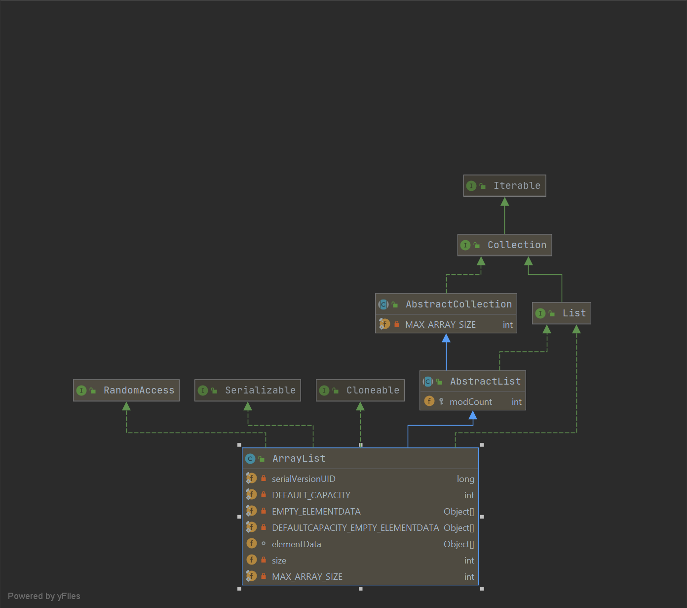

------

# 源码浅析_Java_Collection_HashMap

> 作者：Echo


## 源码分析

### Diagram图



### 源码解析

```java
/**
 * ArrayList是一个实现了List接口的大小可调控的数组，它实现了List所有的可选择操作，并允许包含null在内的多有元素。除了实现List接口以外，这个类还提供了方法来操纵这个类内部使用的来存储列表的数组的大小（这个类大致和Vector相当，但是这个类是不同步的）。
 * size(),isEmpty(),get(),set(),iterator()和ListItr操作运行在固定时间的，add操作运行在摊余固定时间内，这也就是说，添加n个元素需要O（n）时间，粗略地讲，所有其他的操作都是线性运行地，与Linked List相比，它的常量因子更低。
 * 每个ArrayList实例都有一个容量，这个容量是list中用来存储元素的大小，它最少也是和list的大小一样大。在元素被添加到ArrayList中时，它的容量自动增长，添加一个元素除了有固定摊余时间这一事实外，增长策略的细节没有被指定。
 * 应用程序可以在添加大量元素之前通过ensureCapacity方法增加ArrayList的容量，这个过程可能会减少增量重新分配的大小。
 * 注意到这个ArrayList是不同步的，当多线程同时访问一个ArrayList的实例，并且至少有一个线程修改了这个list的结构，它必须在外部同步。（修改结构指的是：任何一项添加，删除一个或多个元素，或者显示改变备份数组大小，仅仅设定元素的值并不是改变结构）这一般是通过同步一些封装了list的对象来完成的。
 * 如果不存在这样的对象，那么list需要通过使用Collections.synchronizedList方法来包装起来，这最好在创建时做，这样可以防止意外地未同步访问list：
 *     List list = Collections.synchronizedList(new ArrayList(...));
 * 这个类的iterator和listIterator方法返回的iterators是fail-fast的，fail-fast指的是：
 * 在list的迭代器创建之后，除了迭代器自身的add和remove元素意外，以任何方式对list进行结构性修改，迭代器将会抛出一个ConcurrentModificationException异常，这样，在并发修改的情况下，迭代器会快速而干净地失败，而不是在将来会冒着有任意的，不确定的行为的风险。
 * 注意到迭代器的fail-fast行为并不能得到保证，通俗地讲，在未同步的并发修改时不可能做出肯定的保证，fail-fast尽最大努力抛出ConcurrentModificationException异常，因此，编写一个依赖这个异常来保证正确性的程序是错误的想法，迭代器的fail-fast行为应该仅仅用来侦测bugs。
 */ 
public class ArrayList<E> extends AbstractList<E>
        implements List<E>, RandomAccess, Cloneable, java.io.Serializable
{
    private static final long serialVersionUID = 8683452581122892189L;

    /**
     * 默认初始化的容量大小10.
     */
    private static final int DEFAULT_CAPACITY = 10;

    /**
     * 共享空的数组实例（给空实例用的）.
     */
    private static final Object[] EMPTY_ELEMENTDATA = {};

    /**
     * 用于默认大小的空实例的共享空数组实例.
     * 我们把它和EMPTY_ELEMENTDATA区别出来，这样才知道当第一个元素被添加以后怎么扩容.
     */
    private static final Object[] DEFAULTCAPACITY_EMPTY_ELEMENTDATA = {};

    /**
     * 保存在ArrayList中的元素的数组缓存，其实就是保存ArrayList数据的数组，这个说是缓存，其实才是真正的数据内容.
     * ArrayList的容量是这个数组缓存elementData的长度. Any
     * 当以一个元素被添加进来时，任何的elementData == DEFAULTCAPACITY_EMPTY_ELEMENTDATA的空ArrayList将会被扩展成elementData == DEFAULT_CAPACITY.
     */
    transient Object[] elementData; // non-private to simplify nested class access

    /**
     * ArrayList的大小 (包含的元素数目).
     *
     * @serial
     */
    private int size;

    /**
     * 带有初始容量的构造函数，构造出一个空的list.
     */
    public ArrayList(int initialCapacity) {
        if (initialCapacity > 0) {
            this.elementData = new Object[initialCapacity];
        } else if (initialCapacity == 0) {
            this.elementData = EMPTY_ELEMENTDATA;
        } else {
            throw new IllegalArgumentException("Illegal Capacity: "+
                                               initialCapacity);
        }
    }

    /**
     * 构造一个初始容量为10的空list.
     */
    public ArrayList() {
        this.elementData = DEFAULTCAPACITY_EMPTY_ELEMENTDATA;
    }

    /**
     * 构造一个包含指定集合元素的list, 并由集合迭代器的顺序排列.
     */
    public ArrayList(Collection<? extends E> c) {
        // 把集合c转换成数组
        Object[] a = c.toArray();
        // 集合c不为空
        if ((size = a.length) != 0) {
            // 集合c的类型是ArrayList类型
            if (c.getClass() == ArrayList.class) {
                elementData = a;
            } else {
                // 集合c的类型不是ArrayList类型，要用.copyOf方法来获取新的数组
                elementData = Arrays.copyOf(a, size, Object[].class);
            }
        } else {
            // 集合c为空的情况下用空数组代替.
            elementData = EMPTY_ELEMENTDATA;
        }
    }

    /**
     * 修改ArrayList实例的容量使其为当前大小
     * 应用程序使用这个操作来最小化ArrayList实例的存储.
     */
    public void trimToSize() {
        modCount++;
        if (size < elementData.length) {
            elementData = (size == 0)
              ? EMPTY_ELEMENTDATA
              : Arrays.copyOf(elementData, size);
        }
    }
    

    /**
     * 这个是ArrayList的扩容机制
     * 增加Array List实例的容量,
     * 如有必要，确保实例至少能容纳这个由最小容量指定的元素的数目
     */
    public void ensureCapacity(int minCapacity) {
        int minExpand = (elementData != DEFAULTCAPACITY_EMPTY_ELEMENTDATA)
            // any size if not default element table
            ? 0
            // larger than default for default empty table. It's already
            // supposed to be at default size.
            : DEFAULT_CAPACITY;

        if (minCapacity > minExpand) {
            ensureExplicitCapacity(minCapacity);
        }
    }

    // 计算最小扩容量
    private static int calculateCapacity(Object[] elementData, int minCapacity) {
        if (elementData == DEFAULTCAPACITY_EMPTY_ELEMENTDATA) {
            return Math.max(DEFAULT_CAPACITY, minCapacity);
        }
        return minCapacity;
    }

    private void ensureCapacityInternal(int minCapacity) {
        ensureExplicitCapacity(calculateCapacity(elementData, minCapacity));
    }

    // ensureCapacity(int minCapacity)调用这个方法，
    private void ensureExplicitCapacity(int minCapacity) {
        modCount++;

        // overflow-conscious code
        if (minCapacity - elementData.length > 0)
            grow(minCapacity);
    }

    /**
     * 分配的数组的最大大小.
     * Some VMs reserve some header words in an array.
     * Attempts to allocate larger arrays may result in
     * OutOfMemoryError: Requested array size exceeds VM limit
     */
    private static final int MAX_ARRAY_SIZE = Integer.MAX_VALUE - 8;

    /**
     * 这个是扩容的核心方法，增加容量使得这个arraylist可以容纳指定的最小容量参数的元素数目.
     */
    private void grow(int minCapacity) {
        // overflow-conscious code
        // oldCapacity是原来的容量
        int oldCapacity = elementData.length;
        // 左移代表除以2，就是说newCapacity现在是oldCapacity的1.5倍容量大小
        int newCapacity = oldCapacity + (oldCapacity >> 1);
        // 如果newCapacity还是比minCapacity小，就用minCapacity代替newCapacity
        if (newCapacity - minCapacity < 0)
            newCapacity = minCapacity;
        // 为了防止newCapacity无限大，要用hugeCapacity函数控制其大小
        if (newCapacity - MAX_ARRAY_SIZE > 0)
            // 要是newCapacity超过了int最大值，newCapacity就是Integer.MAX_VALUE，没超过就是MAX_ARRAY_SIZE
            newCapacity = hugeCapacity(minCapacity);
        // minCapacity is usually close to size, so this is a win:
        elementData = Arrays.copyOf(elementData, newCapacity);
    }

    // grow函数调用的方法，比较minCapacity和MAX_ARRAY_SIZE的大小用
    private static int hugeCapacity(int minCapacity) {
        if (minCapacity < 0) // overflow
            throw new OutOfMemoryError();
        return (minCapacity > MAX_ARRAY_SIZE) ?
            Integer.MAX_VALUE :
            MAX_ARRAY_SIZE;
    }

    /**
     * 返回这个数组的元素个数.
     */
    public int size() {
        return size;
    }

    /**
     * 判断这个list是否为空.
     */
    public boolean isEmpty() {
        return size == 0;
    }

    /**
     * 如果list包含指定的元素就返回true.
     */
    public boolean contains(Object o) {
        return indexOf(o) >= 0;
    }

    /**
     * 返回指定元素在list中第一次出现的索引，-1表示没有这个元素.
     */
    public int indexOf(Object o) {
        if (o == null) {
            for (int i = 0; i < size; i++)
                if (elementData[i]==null)
                    return i;
        } else {
            for (int i = 0; i < size; i++)
                if (o.equals(elementData[i]))
                    return i;
        }
        return -1;
    }

    /**
     * 和indexOf相反，返回指定元素在list中最后出现的索引，-1表示没有.
     */
    public int lastIndexOf(Object o) {
        if (o == null) {
            for (int i = size-1; i >= 0; i--)
                if (elementData[i]==null)
                    return i;
        } else {
            for (int i = size-1; i >= 0; i--)
                if (o.equals(elementData[i]))
                    return i;
        }
        return -1;
    }

    /**
     * 返回这个ArrayList实例的浅拷贝，元素本身不会被拷贝.
     */
    public Object clone() {
        try {
            ArrayList<?> v = (ArrayList<?>) super.clone();
            v.elementData = Arrays.copyOf(elementData, size);
            v.modCount = 0;
            return v;
        } catch (CloneNotSupportedException e) {
            // this shouldn't happen, since we are Cloneable
            throw new InternalError(e);
        }
    }

    /**
     * 从第一个到最后一个，以正确的顺序返回一个包含list中所有元素的数组.
     */
    public Object[] toArray() {
        return Arrays.copyOf(elementData, size);
    }

    /**
     * Returns an array containing all of the elements in this list in proper
     * sequence (from first to last element); the runtime type of the returned
     * array is that of the specified array.  If the list fits in the
     * specified array, it is returned therein.  Otherwise, a new array is
     * allocated with the runtime type of the specified array and the size of
     * this list.
     *
     * <p>If the list fits in the specified array with room to spare
     * (i.e., the array has more elements than the list), the element in
     * the array immediately following the end of the collection is set to
     * <tt>null</tt>.  (This is useful in determining the length of the
     * list <i>only</i> if the caller knows that the list does not contain
     * any null elements.)
     *
     * @param a the array into which the elements of the list are to
     *          be stored, if it is big enough; otherwise, a new array of the
     *          same runtime type is allocated for this purpose.
     * @return an array containing the elements of the list
     * @throws ArrayStoreException if the runtime type of the specified array
     *         is not a supertype of the runtime type of every element in
     *         this list
     * @throws NullPointerException if the specified array is null
     */
    @SuppressWarnings("unchecked")
    public <T> T[] toArray(T[] a) {
        if (a.length < size)
            // Make a new array of a's runtime type, but my contents:
            return (T[]) Arrays.copyOf(elementData, size, a.getClass());
        System.arraycopy(elementData, 0, a, 0, size);
        if (a.length > size)
            a[size] = null;
        return a;
    }

    // Positional Access Operations

    @SuppressWarnings("unchecked")
    E elementData(int index) {
        return (E) elementData[index];
    }

    /**
     * 返回list中指定位置的元素.
     */
    public E get(int index) {
        // 检查index有没有超出list大小size的界限
        rangeCheck(index);

        return elementData(index);
    }

    /**
     * 用指定的元素代替list中指定位置的元素.
     */
    public E set(int index, E element) {
        rangeCheck(index);

        E oldValue = elementData(index);
        elementData[index] = element;
        // 返回的是旧的元素
        return oldValue;
    }

    /**
     * 在list最后添加指定的元素.
     */
    public boolean add(E e) {
        ensureCapacityInternal(size + 1);  // Increments modCount!!
        elementData[size++] = e;
        return true;
    }

    /**
     * Inserts the specified element at the specified position in this在list的指定位置插入指定元素，移动当前元素和其他元素到正确的地方。
     */
    public void add(int index, E element) {
        // 检擦index在0到list的size之间
        rangeCheckForAdd(index);

        ensureCapacityInternal(size + 1);  // Increments modCount!!
        // 把index后面的element往后移
        System.arraycopy(elementData, index, elementData, index + 1,
                         size - index);
        elementData[index] = element;
        size++;
    }

    /**
     * 移除list中指定位置上的元素，后面的元素要左移，返回的是list中删除的元素。
     */
    public E remove(int index) {
        rangeCheck(index);

        modCount++;
        E oldValue = elementData(index);

        int numMoved = size - index - 1;
        if (numMoved > 0)
            System.arraycopy(elementData, index+1, elementData, index,
                             numMoved);
        elementData[--size] = null; // clear to let GC do its work

        return oldValue;
    }

    /**
     * 从list中删除第一个出现的指定元素，如果不存在，list不会变化。
     */
    public boolean remove(Object o) {
        if (o == null) {
            for (int index = 0; index < size; index++)
                if (elementData[index] == null) {
                    fastRemove(index);
                    return true;
                }
        } else {
            for (int index = 0; index < size; index++)
                if (o.equals(elementData[index])) {
                    fastRemove(index);
                    return true;
                }
        }
        return false;
    }

    /*
     * 私有方法，是remove的变种版本，跳过了边界检查，并且不会有返回值.
     */
    private void fastRemove(int index) {
        modCount++;
        int numMoved = size - index - 1;
        if (numMoved > 0)
            System.arraycopy(elementData, index+1, elementData, index,
                             numMoved);
        elementData[--size] = null; // clear to let GC do its work
    }

    /**
     * 删除list的所有元素，list将被清空.
     */
    public void clear() {
        modCount++;

        // clear to let GC do its work
        for (int i = 0; i < size; i++)
            elementData[i] = null;

        size = 0;
    }

    /**
     * 按照指定集合的迭代器在list末尾添加指定的集合.
     */
    public boolean addAll(Collection<? extends E> c) {
        Object[] a = c.toArray();
        int numNew = a.length;
        ensureCapacityInternal(size + numNew);  // Increments modCount
        System.arraycopy(a, 0, elementData, size, numNew);
        size += numNew;
        return numNew != 0;
    }

    /**
     * 按照指定集合的迭代器在指定的位置，在list中插入指定集合的所有元素.  右移当前元素及后面的元素
     */
    public boolean addAll(int index, Collection<? extends E> c) {
        rangeCheckForAdd(index);

        Object[] a = c.toArray();
        int numNew = a.length;
        ensureCapacityInternal(size + numNew);  // Increments modCount

        int numMoved = size - index;
        if (numMoved > 0)
            System.arraycopy(elementData, index, elementData, index + numNew,
                             numMoved);

        System.arraycopy(a, 0, elementData, index, numNew);
        size += numNew;
        return numNew != 0;
    }

    /**
     * 删除[fromIndex, toIndex)内的所有元素，并将其他后续元素往左移
     */
    protected void removeRange(int fromIndex, int toIndex) {
        modCount++;
        int numMoved = size - toIndex;
        System.arraycopy(elementData, toIndex, elementData, fromIndex,
                         numMoved);

        // clear to let GC do its work
        int newSize = size - (toIndex-fromIndex);
        for (int i = newSize; i < size; i++) {
            elementData[i] = null;
        }
        size = newSize;
    }

    /**
     * 检查index是否在list的数组大小范围内.
     */
    private void rangeCheck(int index) {
        if (index >= size)
            throw new IndexOutOfBoundsException(outOfBoundsMsg(index));
    }

    /**
     * 供add和addAll使用的范围检查方法版本.
     */
    private void rangeCheckForAdd(int index) {
        if (index > size || index < 0)
            throw new IndexOutOfBoundsException(outOfBoundsMsg(index));
    }

    /**
     * 构造越界信息的字符串拼接信息.
     */
    private String outOfBoundsMsg(int index) {
        return "Index: "+index+", Size: "+size;
    }

    /**
     * 删除list中集合c包含的所有元素.
     */
    public boolean removeAll(Collection<?> c) {
        Objects.requireNonNull(c);
        return batchRemove(c, false);
    }

    /**
     * 仅仅保留list中集合c的所有元素，换言之，就是删除list中不在集合c中的元素.
     */
    public boolean retainAll(Collection<?> c) {
        Objects.requireNonNull(c);
        return batchRemove(c, true);
    }

    private boolean batchRemove(Collection<?> c, boolean complement) {
        final Object[] elementData = this.elementData;
        int r = 0, w = 0;
        boolean modified = false;
        try {
            for (; r < size; r++)
                if (c.contains(elementData[r]) == complement)
                    elementData[w++] = elementData[r];
        } finally {
            // Preserve behavioral compatibility with AbstractCollection,
            // even if c.contains() throws.
            if (r != size) {
                System.arraycopy(elementData, r,
                                 elementData, w,
                                 size - r);
                w += size - r;
            }
            if (w != size) {
                // clear to let GC do its work
                for (int i = w; i < size; i++)
                    elementData[i] = null;
                modCount += size - w;
                size = w;
                modified = true;
            }
        }
        return modified;
    }

    /**
     * 保存ArrayList实例的状态到stream里，也就是说序列化它.
     */
    private void writeObject(java.io.ObjectOutputStream s)
        throws java.io.IOException{
        // Write out element count, and any hidden stuff
        int expectedModCount = modCount;
        s.defaultWriteObject();

        // Write out size as capacity for behavioural compatibility with clone()
        s.writeInt(size);

        // Write out all elements in the proper order.
        for (int i=0; i<size; i++) {
            s.writeObject(elementData[i]);
        }

        if (modCount != expectedModCount) {
            throw new ConcurrentModificationException();
        }
    }

    /**
     * 从一个stream中重组ArrayList实例（反序列化）.
     */
    private void readObject(java.io.ObjectInputStream s)
        throws java.io.IOException, ClassNotFoundException {
        elementData = EMPTY_ELEMENTDATA;

        // Read in size, and any hidden stuff
        s.defaultReadObject();

        // Read in capacity
        s.readInt(); // ignored

        if (size > 0) {
            // be like clone(), allocate array based upon size not capacity
            int capacity = calculateCapacity(elementData, size);
            SharedSecrets.getJavaOISAccess().checkArray(s, Object[].class, capacity);
            ensureCapacityInternal(size);

            Object[] a = elementData;
            // Read in all elements in the proper order.
            for (int i=0; i<size; i++) {
                a[i] = s.readObject();
            }
        }
    }

    /**
     * 从list的指定位置开始，以正确的顺序返回list中元素的list迭代器.
     * 指定的索引意味着第一个元素的返回值会由初始调用指向next，初始调用pre将会返回指定index-1的元素
     * 返回的list迭代器是fail-fast的
     */
    public ListIterator<E> listIterator(int index) {
        if (index < 0 || index > size)
            throw new IndexOutOfBoundsException("Index: "+index);
        return new ListItr(index);
    }

    /**
     * 按合适的顺序返回list的迭代器.
     * 返回的list迭代器是fail-fast的
     */
    public ListIterator<E> listIterator() {
        return new ListItr(0);
    }

    /**
     * 按合适的顺序返回list的迭代器.
     * 返回的list迭代器是fail-fast的
     */
    public Iterator<E> iterator() {
        return new Itr();
    }
...
}
```

## 扩容机制

### 逻辑流程

Array List有三种构造方法，无参构造函数，和两个带参数的构造函数，以无参构造函数为例：

```java
List<String> list = new ArrayList<>();
list.add("hello");
```

ArrayList.add()

第一次添加hello时，size是0。

```java
/**
 * 在list最后添加指定的元素.
 */
public boolean add(E e) {
    ensureCapacityInternal(size + 1);  // Increments modCount!!
    elementData[size++] = e;
    return true;
}
```

ArrayList.ensureCapacityInternal()

minCapacity是1，calculateCapacity计算出来的minCapacity是10。

```java
private void ensureCapacityInternal(int minCapacity) {
    ensureExplicitCapacity(calculateCapacity(elementData, minCapacity));
}

// 计算最小扩容量
private static int calculateCapacity(Object[] elementData, int minCapacity) {
    if (elementData == DEFAULTCAPACITY_EMPTY_ELEMENTDATA) {
        return Math.max(DEFAULT_CAPACITY, minCapacity);
    }
    return minCapacity;
}

```

ArrayList.ensureExplicitCapacity()

第一次add时，要走grow(10)

```java

// ensureCapacity(int minCapacity)调用这个方法，
private void ensureExplicitCapacity(int minCapacity) {
    modCount++;

    // overflow-conscious code
    if (minCapacity - elementData.length > 0)
        grow(minCapacity);
}
```
ArrayList.grow()

第一次add时，oldCapacity和newCapacity都是0，所以扩容成默认的10。

```java
/**
 * 这个是扩容的核心方法，增加容量使得这个arraylist可以容纳指定的最小容量参数的元素数目.
 */
private void grow(int minCapacity) {
    // overflow-conscious code
    // oldCapacity是原来的容量
    int oldCapacity = elementData.length;
    // 左移代表除以2，就是说newCapacity现在是oldCapacity的1.5倍容量大小
    int newCapacity = oldCapacity + (oldCapacity >> 1);
    // 如果newCapacity还是比minCapacity小，就用minCapacity代替newCapacity
    if (newCapacity - minCapacity < 0)
        newCapacity = minCapacity;
    // 为了防止newCapacity无限大，要用hugeCapacity函数控制其大小
    if (newCapacity - MAX_ARRAY_SIZE > 0)
        // 要是newCapacity超过了int最大值，newCapacity就是Integer.MAX_VALUE，没超过就是MAX_ARRAY_SIZE
        newCapacity = hugeCapacity(minCapacity);
    // minCapacity is usually close to size, so this is a win:
    elementData = Arrays.copyOf(elementData, newCapacity);
}

// minCapacity大于2147483639才会用到
private static int hugeCapacity(int minCapacity) {
    if (minCapacity < 0) // overflow
        throw new OutOfMemoryError();
    return (minCapacity > MAX_ARRAY_SIZE) ?
        Integer.MAX_VALUE :
    MAX_ARRAY_SIZE;
}
```
Arrays.copyOf()

```java
public static <T> T[] copyOf(T[] original, int newLength) {
    return (T[]) copyOf(original, newLength, original.getClass());
}
public static <T,U> T[] copyOf(U[] original, int newLength, Class<? extends T[]> newType) {
        @SuppressWarnings("unchecked")
        T[] copy = ((Object)newType == (Object)Object[].class)
            ? (T[]) new Object[newLength]
            : (T[]) Array.newInstance(newType.getComponentType(), newLength);
        System.arraycopy(original, 0, copy, 0,
                         Math.min(original.length, newLength));
        return copy;
    }
```

System.arraycopy()

```java
    public static native void arraycopy(Object src,  int  srcPos,
                                        Object dest, int destPos,
                                        int length);
```

分析

| add次数                | 1                                                            | 2          | 3          |
| ---------------------- | ------------------------------------------------------------ | ---------- | ---------- |
| ensureCapacityInternal | size+1=1                                                     | 2          | 3          |
| calculateCapacity      | elementData == DEFAULTCAPACITY_EMPTY_ELEMENTDATA，返回Math.max(DEFAULT_CAPACITY, minCapacity)的值10 | 2          | 3          |
| ensureExplicitCapacity | minCapacity - elementData.length>0，进入grow()               | 不进入grow | 不进入grow |
| grow()                 | newCapacity - minCapacity < 0，扩容成10                      | -          | -          |

第一次add，会进入ensureCapacityInternal(1)，先通过calculateCapacity(1)计算出需要的容量，此时elementData还是默认的空实例，所以取得Math.max(DEFAULT_CAPACITY, minCapacity)的值10，进入ensureExplicitCapacity(10)，10- elementData.length > 0就要进入grow(10)，这里面newCapacity要扩容成oldCapacity的1.5倍，在和10比较，10 - newCapacity > 0，开始用Arrays.copyOf(elementData, 10)扩容

第二次add，会进入ensureCapacityInternal(2)，先通过calculateCapacity(1)计算出需要的容量，此时elementData不是默认的空实例，所以直接取值2，进入ensureExplicitCapacity(2)，此时elementData.length已经扩容成了10，2- elementData.length < 0就不会进入grow(minCapacity)进行扩容了。

第三次add，第四次add情况和第二次相同，知道第十一次时，才会再次进入grow(minCapacity)进行扩容。