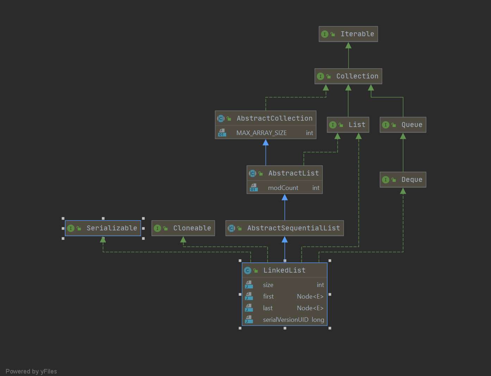

------

# 源码浅析_Java_Collection_LinkedList

> 作者：Echo

LinkedList是`List` 接口的链接列表实现。实现所有可选的列表操作，并且允许所有元素（包括 `null`）。除了实现  `List` 接口外，`LinkedList` 类还为在列表的开头及结尾 `get`、`remove`  和 `insert` 元素提供了统一的命名方法。这些操作允许将链接列表用作堆栈、[队列](../../java/util/Queue.html)或[双端队列](../../java/util/Deque.html)。

此类实现 `Deque` 接口，为 `add`、`poll` 提供先进先出队列操作，以及其他堆栈和双端队列操作。

所有操作都是按照双重链接列表的需要执行的。在列表中编索引的操作将从开头或结尾遍历列表（从靠近指定索引的一端）。


**注意，此实现不是同步的。**如果多个线程同时访问一个链接列表，而其中至少一个线程从结构上修改了该列表，则它*必须*  保持外部同步。（结构修改指添加或删除一个或多个元素的任何操作；仅设置元素的值不是结构修改。）这一般通过对自然封装该列表的对象进行同步操作来完成。如果不存在这样的对象，则应该使用  [`Collections.synchronizedList`](../../java/util/Collections.html#synchronizedList(java.util.List))  方法来“包装”该列表。最好在创建时完成这一操作，以防止对列表进行意外的不同步访问，如下所示： 

```
   List list = Collections.synchronizedList(new LinkedList(...));
```

此类的 `iterator` 和 `listIterator` 方法返回的迭代器是*快速失败*  的：在迭代器创建之后，如果从结构上对列表进行修改，除非通过迭代器自身的 `remove` 或 `add`  方法，其他任何时间任何方式的修改，迭代器都将抛出 [`ConcurrentModificationException`](../../java/util/ConcurrentModificationException.html)。因此，面对并发的修改，迭代器很快就会完全失败，而不冒将来不确定的时间任意发生不确定行为的风险。 

注意，迭代器的快速失败行为不能得到保证，一般来说，存在不同步的并发修改时，不可能作出任何硬性保证。快速失败迭代器尽最大努力抛出  `ConcurrentModificationException`。因此，编写依赖于此异常的程序的方式是错误的，正确做法是：*迭代器的快速失败行为应该仅用于检测程序错误。* 

此类是 [Java  Collections Framework](../../../technotes/guides/collections/index.html) 的成员。 

> 以上中文翻译摘自：https://tool.oschina.net/apidocs/apidoc?api=jdk-zh

## Diagram图



## 数据结构

**如下图所示：**

[](https://github.com/Snailclimb/JavaGuide/blob/master/docs/java/collection/images/linkedlist/LinkedList内部结构.png) 

看完了图之后，我们再看LinkedList类中的一个**内部私有类Node**就很好理解了：

```java
private static class Node<E> {
    E item; // 节点值
    Node<E> next; // 后继节点
    Node<E> prev; // 前驱节点

    Node(Node<E> prev, E element, Node<E> next) {
        this.item = element;
        this.next = next;
        this.prev = prev;
    }
}
```

## 源码解析

### 成员变量

```java
public class LinkedList<E>
    extends AbstractSequentialList<E>
    implements List<E>, Deque<E>, Cloneable, java.io.Serializable
{
    // 链表长度
    transient int size = 0;

    /**
     * Pointer to first node.
     * Invariant: (first == null && last == null) ||
     *            (first.prev == null && first.item != null)
     * 永远指向第一个节点
     */
    transient Node<E> first;

    /**
     * Pointer to last node.
     * Invariant: (first == null && last == null) ||
     *            (last.next == null && last.item != null)
     * 永远指向最后一个节点
     */
    transient Node<E> last;

```

### 内部静态类

Node就是它的内部类，表示LinkedList内部节点的结构

```java
private static class Node<E> {
    E item; // 节点值
    Node<E> next; // 后继节点
    Node<E> prev; // 前驱节点

    Node(Node<E> prev, E element, Node<E> next) {
        this.item = element;
        this.next = next;
        this.prev = prev;
    }

}
```


### 构造方法

```java
/**
 * Constructs an empty list.
 * 构造一个空的链表
 */
public LinkedList() {
}

/**
 * Constructs a list containing the elements of the specified
 * collection, in the order they are returned by the collection's
 * iterator.
 *
 * @param  c the collection whose elements are to be placed into this list
 * @throws NullPointerException if the specified collection is null
 * 构造一个包含指定元素的列表。
 */
public LinkedList(Collection<? extends E> c) {
    this();
    addAll(c);
}
```

### add方法

add(E e)方法将指定的元素添加到链表的队尾。

```java
/**
 * Appends the specified element to the end of this list.
 *
 * <p>This method is equivalent to {@link #addLast}.
 *
 * @param e element to be appended to this list
 * @return {@code true} (as specified by {@link Collection#add})
 */
public boolean add(E e) {
    linkLast(e);
    return true;
}

/**
 * Links e as last element.
 */
void linkLast(E e) {
    final Node<E> l = last;
    final Node<E> newNode = new Node<>(l, e, null);
    last = newNode;
    if (l == null)
        first = newNode;
    else
        l.next = newNode;
    size++;
    modCount++;
}
```


## 参考

- https://tool.oschina.net/apidocs/apidoc?api=jdk-zh
- https://github.com/Snailclimb/JavaGuide/blob/master/docs/java/collection/LinkedList%E6%BA%90%E7%A0%81%E5%88%86%E6%9E%90.md
- https://www.fangzhipeng.com/javainterview/2019/03/10/collections-linkedlist.html
- http://www.justdojava.com/2019/04/05/java-List/


